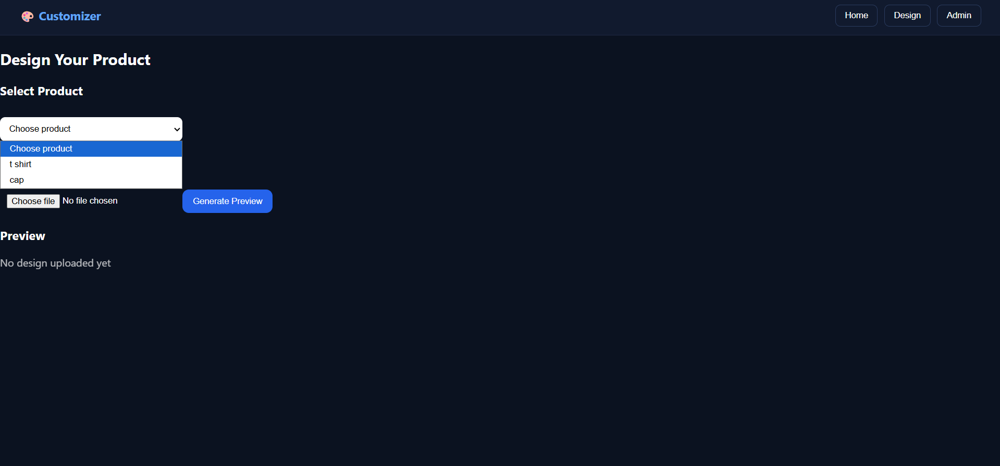
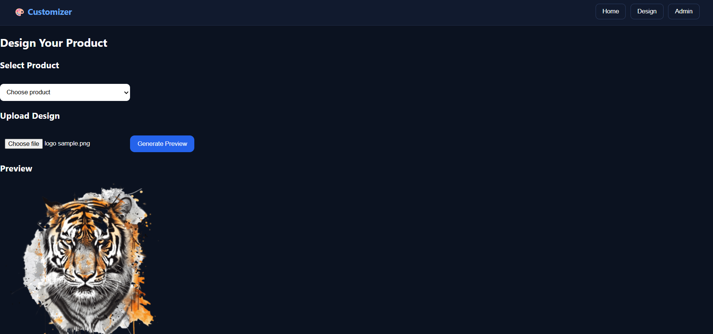
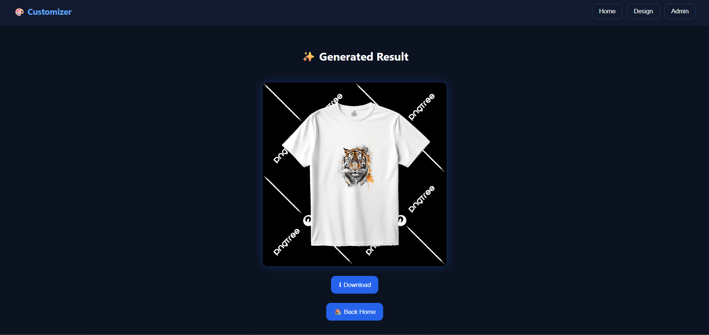

#  Product Customizer

A full-stack web application to apply custom designs on products like T-shirts.

---

## Features
- Upload custom design
- Apply design on product
- Generate preview image
- Download final result

---

## 📸 Screenshots

### 🏠 Home Page

### 🎨 Customizer

### ✨ Result

---

##  Tech Stack
- Frontend: React
- Backend: Django + Django REST Framework
- Image Processing: OpenCV

---

##  Setup Instructions

### 1. Clone Repository
git clone <your-repo-link>
cd product-customizer

---

### 2. Backend Setup
cd backend

python -m venv venv

venv\Scripts\activate   (Windows)

pip install -r requirements.txt

python manage.py runserver

---

### 3. Frontend Setup
cd frontend

npm install
npm start

---

## Notes
- Backend runs on: http://127.0.0.1:8000
- Frontend runs on: http://localhost:3000
